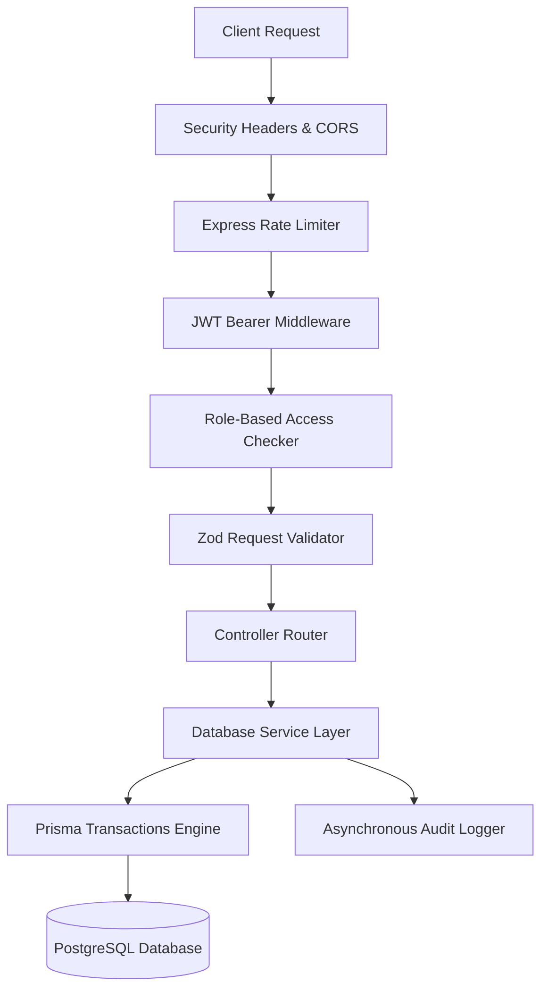

# TransitOps Platform Architecture

This document describes the design principles, structural layering, and data validation flows used in TransitOps.

---

## 1. Directory Division
The repository uses a workspace layout to separate concerns:
- `backend/`: Node.js/Express.js backend utilizing Prisma ORM to communicate with PostgreSQL. Handles business logic, RBAC security, rate limits, audit trails, and validation.
- `frontend/`: Single Page Application (SPA) built using React 19, TypeScript, and Vite. Utilizes Tailwind CSS for presentation and Framer Motion for responsive UX animations.
- `database/`: Repository for teammate SQL scripts, enums, triggers, and mock data.

---

## 2. API Pipeline Layering
Every HTTP request follows a strict unidirectional middleware chain:

---

## 3. Core Architectural Modules

### Database Transaction Engine
All operations modifying state across multiple entities (such as trip dispatches, cancellations, refuels, and maintenance cycles) execute inside **Prisma Transactions**. If any single query in the block fails:
- PostgreSQL performs a full rollback.
- Data remains clean and consistent.
- No partial writes are committed.

### Role-Based Access Control (RBAC)
Security checks query the database user context dynamically before processing the requests. This prevents privilege-escalation and ensures user changes take effect immediately:
- `ADMIN`: Full backend write, read, and delete permissions.
- `FLEET_MANAGER`: Can write and read vehicles, drivers, trips, and maintenance logs.
- `DISPATCHER`: Can manage trips, dispatches, and log refuels.
- `FINANCIAL_ANALYST`: Read-only access to operations; write access to expenses ledger.
- `SAFETY_OFFICER`: Can read and update driver safety scores.

### Audit Trail Compliance
Every state-changing route (such as logins, status changes, and ledger writes) triggers the `AuditLog` middleware. This records the action, entity ID, operator ID, client IP address, and browser metadata. Sensible details like passwords are automatically masked: `"password":"[REDACTED]"`.
